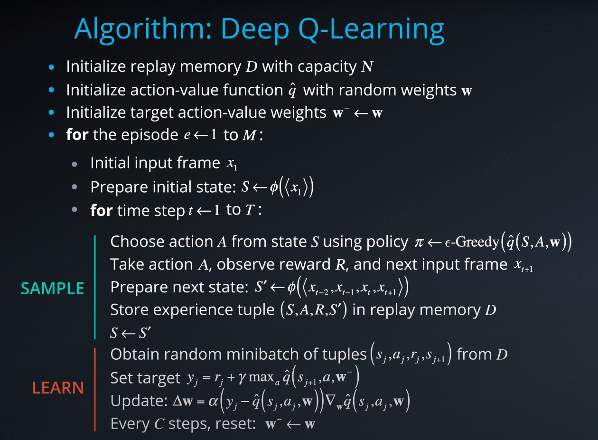
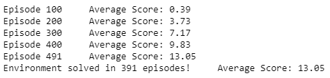
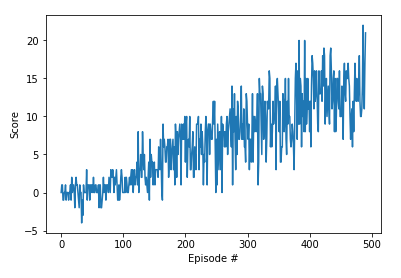

# The Banana King

## Project Objective

In this project, **the objective is to train an agent to navigate a virtual world while collecting as many yellow bananas as possible, while avoiding any blue bananas.**


## Environment details

The environment is based on [Unity ML-agents](https://github.com/Unity-Technologies/ml-agents).

Note: The project environment provided by Udacity is similar to, but not identical to the Banana Collector environment on the Unity ML-Agents GitHub page.

> The Unity Machine Learning Agents Toolkit (ML-Agents) is an open-source Unity plugin that includes an expanding set of example environments that highlight the various features of the toolkit. These environments can also serve as templates for new environments or as ways to test new ML algorithms.

A reward of +1 is returned for collecting a yellow banana, while a reward of -1 is returned for collecting a blue banana. The goal of the agent is to collect as many yellow bananas as possible while avoiding blue bananas.

The state space is 37 dimensions and contains the agent's velocity, along with ray-based perception of any objects around the agent's forward direction. 

Given this information, the agent has to learn how to best select actions. Four discrete actions are available, corresponding to:

- 0 - move forward.
- 1 - move backward.
- 2 - turn left.
- 3 - turn right.

The task is episodic, and **in order to solve the environment, the agent must get an average score of +13 over 100 consecutive episodes.**


## Agent Implementation

### Deep Q-Networks

This project implements a *Value Based* method called [Deep Q-Networks](https://deepmind.com/research/dqn/). 

Deep Q Learning combines two approaches:
- A Reinforcement Learning method called [Q Learning](https://en.wikipedia.org/wiki/Q-learning)
- Q-table approximation (action-values) using a Deep Neural Network 

This implementation includes two training improvements described in their [Nature publication : "Human-level control through deep reinforcement learning (2015)"](https://storage.googleapis.com/deepmind-media/dqn/DQNNaturePaper.pdf).
- Experience Replay 
- Fixed Q Targets

> ABSTRACT: The theory of reinforcement learning provides a normative account<sup>1</sup>,
deeply rooted in psychological<sup>2</sup> and neuroscientific<sup>3</sup> perspectives on
animal behaviour, of how agents may optimize their control of an
environment. To use reinforcement learning successfully in situations
approaching real-world complexity, however, agents are confronted
with a difficult task: they must derive efficient representations of the
environment from high-dimensional sensory inputs, and use these
to generalize past experience to new situations. Remarkably, humans
and other animals seem to solve this problem through a harmonious
combination of reinforcement learning and hierarchical sensory processing
systems<sup>4,5</sup>, the former evidenced by a wealth of neural data
revealing notable parallels betweenthe phasic signals emitted by dopaminergic
neurons and temporal difference reinforcement learning
algorithms<sup>3</sup>. While reinforcement learning agents have achieved some
successes in a variety of domains<sup>6–8</sup>, their applicability has previously
been limited to domains inwhich useful features can be handcrafted,
or to domains with fully observed, low-dimensional state spaces.
Here we use recent advances in training deep neural networks<sup>9–11</sup> to
develop a novel artificial agent, termed a deep Q-network, that can
learn successful policies directly fromhigh-dimensional sensory inputs
using end-to-end reinforcement learning. We tested this agent on
the challenging domain of classic Atari 2600 games<sup>12</sup>. We demonstrate
that the deep Q-network agent, receiving only the pixels and
the game score as inputs, was able to surpass the performance of all
previous algorithms and achieve a level comparable to that of a professional
human games tester across a set of 49 games, using the same
algorithm, network architecture and hyperparameters. This work
bridges the divide between high-dimensional sensory inputs and
actions, resulting in the first artificial agent that is capable of learning
to excel at a diverse array of challenging tasks.

### Algorithm



This algorithm screenshot is taken from the [Deep Reinforcement Learning Nanodegree course](https://www.udacity.com/course/deep-reinforcement-learning-nanodegree--nd893).


### Code implementation

The code is based on the "Lunar Lander" lesson from the [Deep Reinforcement Learning Nanodegree](https://www.udacity.com/course/deep-reinforcement-learning-nanodegree--nd893), and has been modified to solve the navigation problem in the banana environment.

Relevant files include:
- Navigation.ipynb : This Jupyter notebook file is the main driver to allow agent training. It does the following:
  - Imports necessary packages 
  - Examines the state and action spaces
  - Takes Random Actions in the Environment
  - Trains an agent using DQN
  - Plot the scores
  - Saves the scores
  
- model.py : This file defines a PyTorch QNetwork class. The network is fully connected Deep Neural Network using the [PyTorch Framework](https://pytorch.org/docs/0.4.0/). This network is trained to predict the action to perform depending on the environment observed states. This Neural Network is used by the DQN agent and is composed of:
  - the input layer, its size is equal to the state_size parameter passed into the constructor
  - Two hidden fully connected layers, one with 128 cells and the second with 64 cells
  - the output layer which size is set to the action_size parameter passed in the constructor
  
- dqn_agent.py : This file defines a DQN agent and a Replay Buffer memory used by the DQN agent.
  - The DQN agent class is implemented, as described in the Deep Q-Learning algorithm. It provides several methods :
    - constructor: 
      - Initialize the memory buffer (*Replay Buffer*)
      - Initialize two instances of the neural network defined in model.py : the *target* network and the *local* network
    - step function: 
      - Allows to store a step taken by the agent (state, action, reward, next_state, done) in the Replay Buffer/Memory
      - Every 4 steps (and given enough samples in the Replay Buffer), update the *target* network weights with the current weight values from the *local* network
    - act function: returns actions for the given state given under by the current policy. Action selection is done with Epsilon-greedy selection.
    - learn function: updates the *local* network parameters using a given batch of experiences from the replay buffer. 
    - soft_update function is called by learn() to update the *target* neural network parameters from the *local* network weights
  - The ReplayBuffer class implements a fixed-size buffer to store experience tuples  (state, action, reward, next_state, done) 
    - add function adds an experience step to the memory
    - sample function randomly samples a batch of experience steps for the learning       


### DQN Parameters Values, Model Architecture and Results

The DQN agent uses the following parameters values (defined in dqn_agent.py):

```
BUFFER_SIZE = int(1e5)  # replay buffer size
BATCH_SIZE = 64         # minibatch size 
GAMMA = 0.99            # discount factor 
TAU = 1e-3              # for soft update of target parameters
LR = 5e-4               # learning rate 
UPDATE_EVERY = 4        # how often to update the network
```

The Neural Networks use the following architecture:

```
Input nodes (37) -> Fully Connected Layer (128 nodes, Relu activation) -> Fully Connected Layer (64 nodes, Relu activation) -> Ouput nodes (4)
```

The networks use Adam optimization with a learning rate of LR=5e-4 and are trained using a BATCH_SIZE=64.

With the given architecture and parameters, the training logs and results are shown below:





**These results meets the project's expectation as the agent is able to receive an average reward (over 100 episodes) of at least +13, and in fewer than 500 episodes** (For context, Udacity's agent solved the project in fewer than 1800 episodes)

### Ideas for Future Work

An improvement to this solution could be to train the agent directly from the environment's observed raw pixels instead of using the environment's internal states. To do so, a [Convolutional Neural Network](https://en.wikipedia.org/wiki/Convolutional_neural_network) could be added at the input of the network in order to process the raw pixels values. Subsequent layers would still be fully-connected. 

Further augmentations could also be implemented to increase the performance of the agent:
- [Double DQN](https://arxiv.org/abs/1509.06461)
> ABSTRACT: The popular Q-learning algorithm is known to overestimate action values under certain conditions. It was not previously known whether, in practice, such overestimations are common, whether they harm performance, and whether they can generally be prevented. In this paper, we answer all these questions affirmatively. In particular, we first show that the recent DQN algorithm, which combines Q-learning with a deep neural network, suffers from substantial overestimations in some games in the Atari 2600 domain. We then show that the idea behind the Double Q-learning algorithm, which was introduced in a tabular setting, can be generalized to work with large-scale function approximation. We propose a specific adaptation to the DQN algorithm and show that the resulting algorithm not only reduces the observed overestimations, as hypothesized, but that this also leads to much better performance on several games.

- [Prioritized experience replay](https://arxiv.org/abs/1511.05952)
> ABSTRACT: Experience replay lets online reinforcement learning agents remember and reuse experiences from the past. In prior work, experience transitions were uniformly sampled from a replay memory. However, this approach simply replays transitions at the same frequency that they were originally experienced, regardless of their significance. In this paper we develop a framework for prioritizing experience, so as to replay important transitions more frequently, and therefore learn more efficiently. We use prioritized experience replay in Deep Q-Networks (DQN), a reinforcement learning algorithm that achieved human-level performance across many Atari games. DQN with prioritized experience replay achieves a new state-of-the-art, outperforming DQN with uniform replay on 41 out of 49 games.

- [Dueling DQN](https://arxiv.org/abs/1511.06581)
> ABSTRACT: In recent years there have been many successes of using deep representations in reinforcement learning. Still, many of these applications use conventional architectures, such as convolutional networks, LSTMs, or auto-encoders. In this paper, we present a new neural network architecture for model-free reinforcement learning. Our dueling network represents two separate estimators: one for the state value function and one for the state-dependent action advantage function. The main benefit of this factoring is to generalize learning across actions without imposing any change to the underlying reinforcement learning algorithm. Our results show that this architecture leads to better policy evaluation in the presence of many similar-valued actions. Moreover, the dueling architecture enables our RL agent to outperform the state-of-the-art on the Atari 2600 domain.

### Training Hardware Configuration 

This agent has been trained on the Udacity provided online workspace. This environment provides an Nvidia K80 GPU for training. The Unity environment without visualization was used during training.